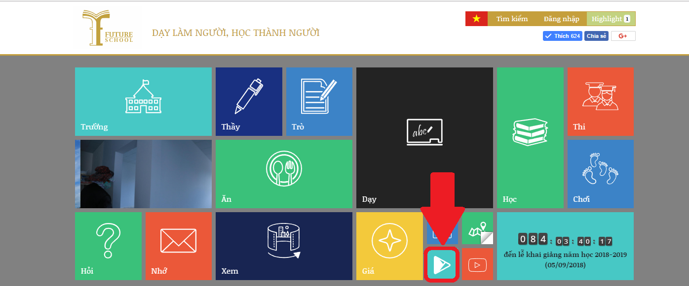

#Ứng dụng FIS
<h3>1. Giới thiệu</h3>

Ứng dụng giúp người dùng tương tác với trường Tiểu học, Trung học cơ sở, Trung học phổ thông Tương Lai. Ứng dụng có các chức năng sau:
<ul>
	<li>Xem tin tức: ứng dụng giúp người dùng xem tin tức của trường một cách nhanh chóng nhất. Các tin tức mới cập nhật sẽ được thông báo đến người dùng</li>
	<li>Nhận thông báo: ứng dụng cho phép người dùng nhận thông báo từ nhà trường một cách nhanh chóng, ngoài ra người dùng còn có thể xem lại các thông báo một cách dễ dàng</li>
	<li>Ứng dụng cho phép người dùng xem một số thông tin về nhà trường như giáo viên, album ảnh</li>
	<li>Phụ huynh có thể trò chuyện, thắc mắc về các vấn đề trong trường học</li>
</ul>
<h3>2. Yêu cầu</h3>

Hiện tại ứng dụng hỗ trợ hệ điều hành android có phiên bản từ 4.1 trở lên

<h3>3. Cách cài đặt</h3>

Các bạn truy cập vào địa chỉ <a href="https://play.google.com/store/apps/details?id=edu.fis">https://play.google.com/store/apps/details?id=edu.fis</a> để tải ứng dụng hoặc truy cập vào địa chỉ website của trường Tương Lai <a href="http://future.edu.vn">future.edu.vn</a> và chọn biểu tượng google play để tải app

